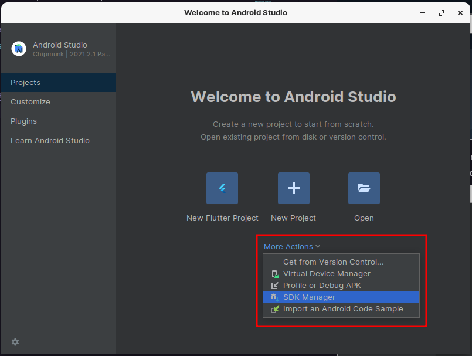

# Configurando ambiente de desenvolvimento Flutter no Ubunto e Derivados

O Flutter é um framework multiplataforma para desenvolvimento de aplicativos Android e iOS utilizando uma mesma base de código. Por ser multiplataforma, o Flutter permite desenvolvermos apps em qualquer sistema operacional (Windows, Linux ou macOS), porém, para isso, precisamos configurar seu ambiente de desenvolvimento, como veremos neste artigo.

---
## Sumário
- <a href="#settingUpTheEnvironment">Configurando o ambiente</a>
    - <a href="#installingTheFlutterSdk">Instalação do Flutter SDK</a>
    - <a href="#installingAndroidStudio">Instalação do Android Studio</a>
    - <a href="#configuringAndroidStudio">Configurando o Android Studio</a>
- <a href="#finishingTheFlutterInstallation">Finalizando a instalação do flutter</a>
    - <a href="#installingPackagesRequiredForTheDevelopmentEnvironment">Instalando pacotes nescessários para o ambiente de desenvolvimento</a>
    - <a href="#checkAll">Vereficando se deu tudo certo</a>

---

## Configurando o ambiente<span id="settingUpTheEnvironment"></span>
Para desenvolvermos com o Flutter, precisaremos dos seguintes itens instalados em nossa máquina:

- Flutter SDK;
- Android Studio e/ou um editor de texto com plug-ins de suporte ao Flutter (vamos utilizar o Android Studio como exemplo);
- Um emulador ou dispositivo para testarmos a aplicação.
- Configurar o plugin do Flutter no Android Studio (ou outro editor de textos com suporte ao Flutter).

Eu utilizo o sistema operacional ZORIN OS mas esse passo a passo é compativel com Ubuntu. 

### Instalação do Flutter SDK<span id="installingTheFlutterSdk"></span>
A instalação no Linux também é relativamente simples, como podemos ver nos passos abaixo:
Vamos instalar o flutter via GIT, para isso rode os comandos abaixo
```shell
cd ~ && git clone https://github.com/flutter/flutter.git -b stable
```
Agora vamos adicior o flutter no PATH do ambiente
```shell
echo 'export PATH="$PATH:`pwd`/flutter/bin"' >> ~/.bashrc
```
Agora vamos carregar a configuração
```shell
source ~/.bashrc
```
Se voce utiliza o ZSH rode tambem o comando abaixo
```shell
echo 'export PATH="$PATH:`pwd`/flutter/bin"' >> ~/.zshrc
```
Agora vamos carregar a configuração
```shell
source ~/.zshrc
```
##### Esse passo é opcional, faça o download prévio de binários de desenvolvimento:
O flutterTools baixa binários de desenvolvimento específicos da plataforma conforme necessário. Para cenários em que o download prévio desses artefatos é preferível (por exemplo, em ambientes de compilação herméticos ou com disponibilidade de rede intermitente), os binários iOS e Android podem ser baixados antecipadamente executando:
```shell
flutter precache
```
### Instalação do Android Studio <span id="installingAndroidStudio"></span>
Além do SDK do Flutter, precisamos instalar o Android Studio, vamos fazer a instalação via linha de comando.
Mas antes precisamos instalar o JAVA JDK, basta rodar o comando abaixo.
```shell
sudo apt install openjdk- 11 -jdk -y
```
Agora que o JDK foi instalado, você deve importar o repositório android-studio executando o comando fornecido abaixo.
```shell
sudo add-apt-repository ppa:maarten-fonville/android-studio
```
Agora atualize seu sistema antes de avançar para a instalação do Android Studio.
```shell
sudo apt update
```
Depois de atualizar o sistema, agora você pode instalar o aplicativo facilmente.
```shell
sudo apt install android-studio -y
```
Agora você só precisa procurar o aplicativo no menu e, assim que encontrá-lo, pode clicar nele para usar o aplicativo.


### Vamos fazer algumas configurações no android studio <span id="configuringAndroidStudio"></span>
Na tela inicial clique em **More Actions** e selecione **SDK Manager**



Agora vamos selecionar para instalar as ferramentas de linha de comando
sigua os passos de 1 a 4


Agora clique em **Apply** e aguarde a instalação


Novamente na tela inicial do android studio, clique em plugins


Agora instale os plugins selecionados


## Finalizando a instalação do flutter <span id="finishingTheFlutterInstallation"></span>

Agora precisamos aceitar as licenças, para isso rode o seguinte comando
```shell
flutter doctor --android-licenses
```
### Instalando pacotes nescessários para o ambiente de desenvolvimento <span id="installingPackagesRequiredForTheDevelopmentEnvironment"></span>
Para o correto funcionamente precisamos instalar mais algins pacotes
```shell
sudo apt install clang cmake ninja-build libgtk-3-dev -y
```

### Vamos vereficar se esta tudo certo <span id="checkAll"></span>
Para checarmos se está tudo certo com o ambiente rode o seguinte comando
```shell
flutter doctor
```
Se estiver tudo certo você terá o seguinte retorno

